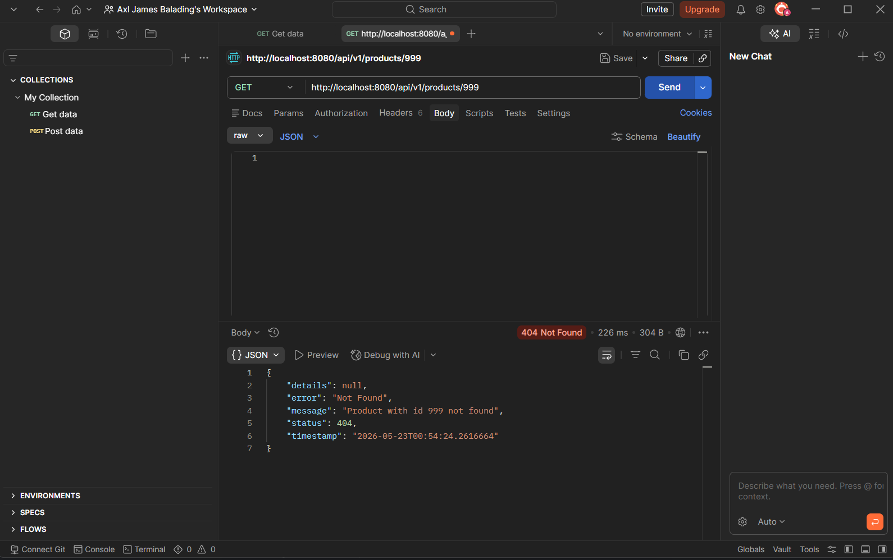
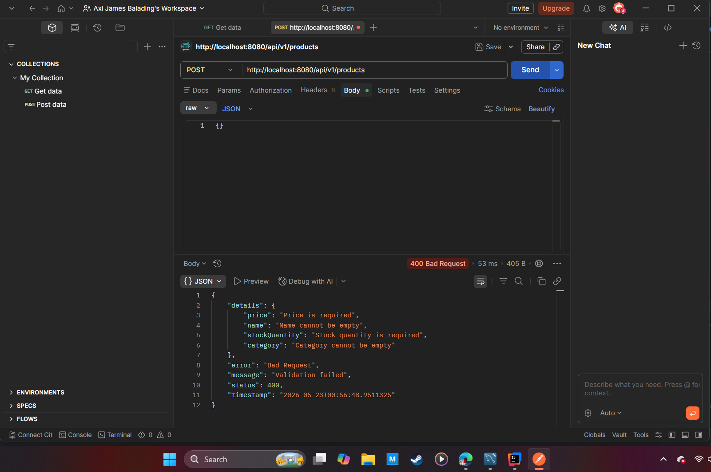
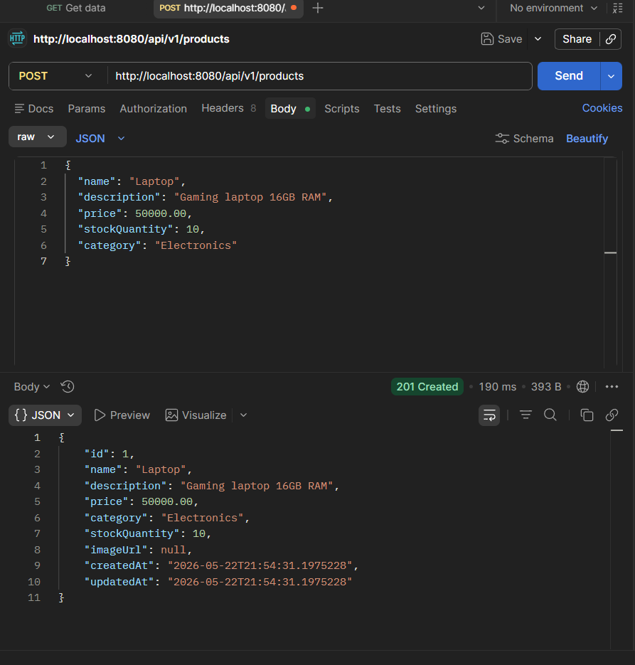
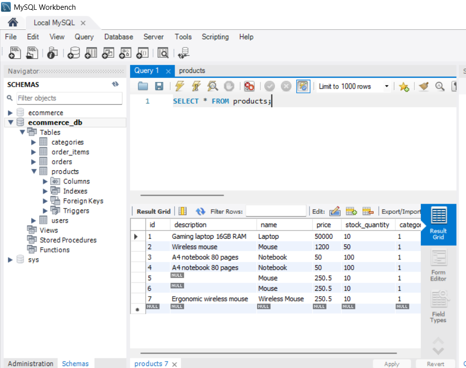
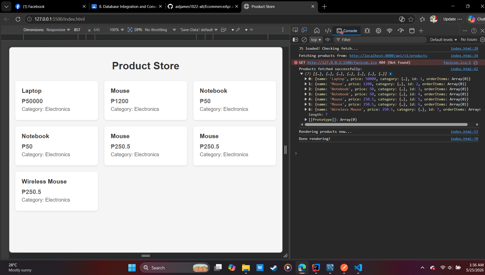
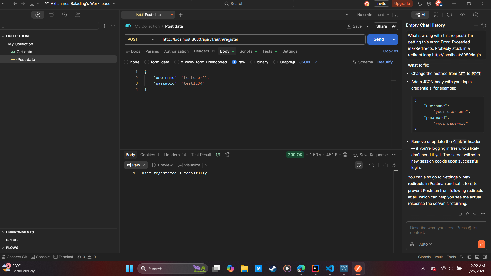
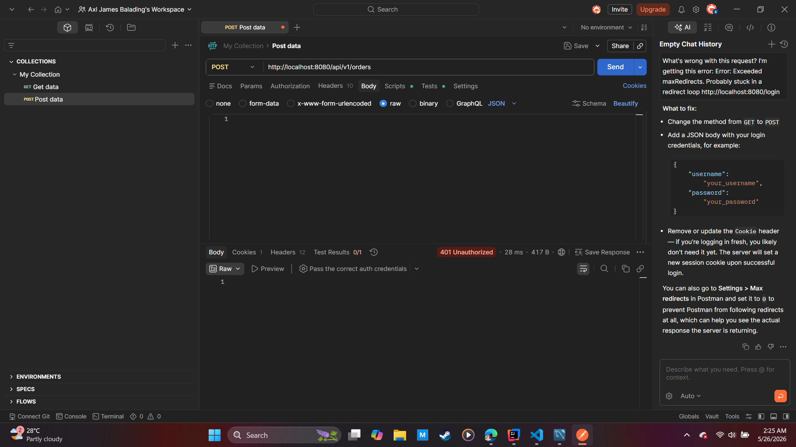
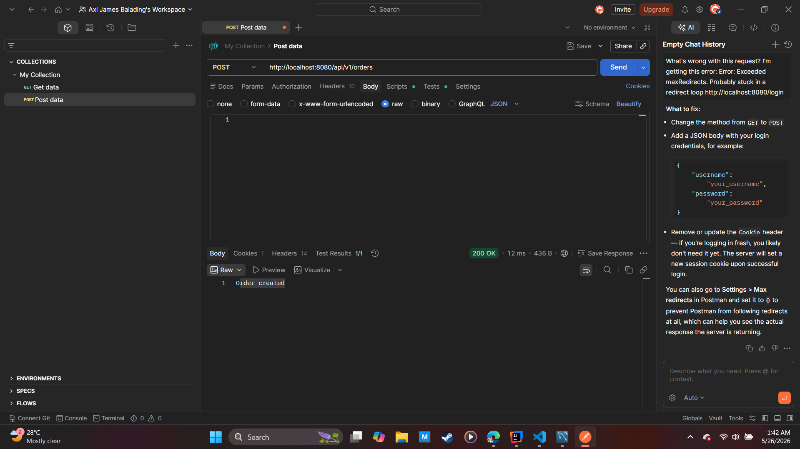
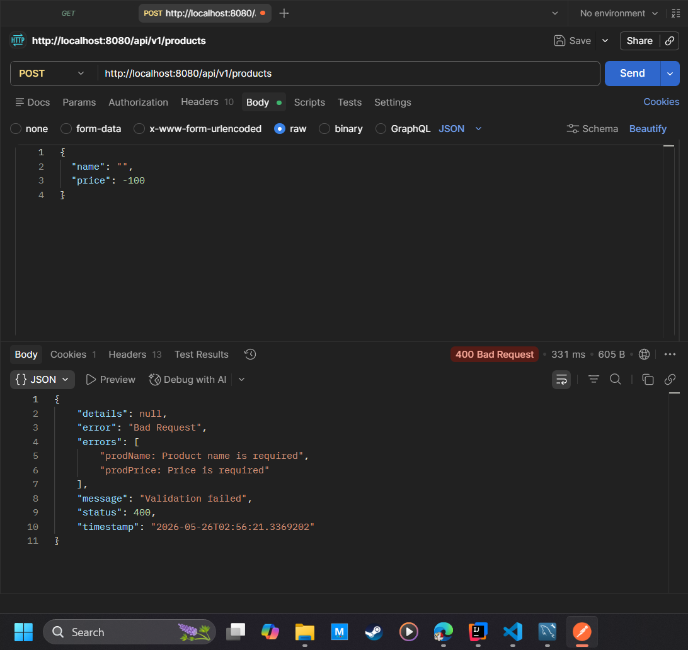

# EcommerceApiV2

## Project Overview
REST API for managing products in an e-commerce system. Built with Spring Boot using in-memory storage.
Supports CRUD operations, filtering by category, searching by name, and input validation.

## Setup Instructions

### Prerequisites
- Java 17 or higher
- IntelliJ IDEA or any Java IDE
- Postman or similar tool for testing API

### How to Run the Application
1. Open the project in IntelliJ IDEA
2. Make sure you're on the `feat/project-setup` branch
3. Run the `EcommerceApiV2Application` class
4. The API will run on `http://localhost:8080`

## API Endpoint Reference

| Method | Path | Description | Expected Response |
| --- | --- | --- | --- |
| GET | `/api/v1/products` | Get all products | 200 OK - List of products |
| GET | `/api/v1/products/{id}` | Get product by ID | 200 OK - Product or 404 Not Found |
| GET | `/api/v1/products/category/{category}` | Get products by category | 200 OK - List of products |
| GET | `/api/v1/products/search?name={name}` | Search products by name | 200 OK - List of products |
| POST | `/api/v1/products` | Create a new product | 201 Created or 400 Bad Request |
| PUT | `/api/v1/products/{id}` | Update a product completely | 200 OK or 404 Not Found |
| PATCH | `/api/v1/products/{id}` | Partially update a product | 200 OK |
| DELETE | `/api/v1/products/{id}` | Delete a product | 204 No Content |

## Testing

**API Test Results:**




## Sample Request/Response Examples

### Create Product - POST /api/v1/products
**Request:**
```json
{
  "name": "Wireless Mouse",
  "price": 250.50,
  "category": "Electronics",
  "stockQuantity": 10,
  "description": "Ergonomic wireless mouse",
  "imageUrl": "http://example.com/mouse.jpg"
}
```

**Success Response 201 Created:**
```json
{
  "id": 1,
  "name": "Wireless Mouse",
  "price": 250.50,
  "category": "Electronics",
  "stockQuantity": 10,
  "description": "Ergonomic wireless mouse",
  "imageUrl": "http://example.com/mouse.jpg"
}
```

### Validation Error - POST /api/v1/products
**Request:**
```json
{
  "name": "A",
  "price": -100,
  "category": "",
  "stockQuantity": -5
}
```
**Error Response 400 Bad Request:**
```json
{
  "name": "Name must be at least 3 characters",
  "price": "Price must be greater than 0",
  "category": "Category cannot be empty",
  "stockQuantity": "Stock quantity cannot be negative"
}
```

### Get All Products - GET /api/v1/products
**Request:**

```http
GET http://localhost:8080/api/v1/products
```
**Response 200 OK:**
```json
[
  {
    "id": 1,
    "name": "Wireless Mouse",
    "price": 250.50,
    "category": "Electronics",
    "stockQuantity": 10
  }
]
```
## Known Limitations
- **In-memory storage**: Data is stored in a HashMap and will be lost when the application restarts.
- **No database**: This version does not use a database like MySQL or PostgreSQL.
- **No authentication**: The API is publicly accessible without login or token.

## Database Schema

### Table: `products`
| Column | Type | Description |
| --- | --- | --- |
| id | BIGINT | Primary Key, Auto Increment |
| name | VARCHAR(255) | Product name |
| price | DECIMAL(10,2) | Product price |
| description | TEXT | Product description |

### Relationships
- Currently only 1 table: `products`
- No foreign key relationships yet

## API Endpoints

| Method | Endpoint | Description |
| --- | --- | --- |
| GET | `/api/products` | Get all products from database |
| POST | `/api/products` | Add new product to database |

## Screenshots

### Database Table with Data


### Browser Console - Successful Fetch


# Ecommerce API v2 - Task 9 Final Documentation

## 1. README.md

### Security Architecture
This application uses **Session-Based Authentication** with Cookies and Server-side Sessions.

**How it works:**
1. User submits credentials to `/login`
2. Spring Security validates against the database using BCrypt password encoder
3. Server creates an HTTP session and stores the authentication object
4. Server sends `JSESSIONID` cookie to the browser
5. For subsequent requests, browser sends the cookie automatically
6. Spring Security reads the session and grants access to protected resources
7. Session is destroyed on logout, revoking access

### Validation Rules
Validation is applied using Jakarta Bean Validation with `@Valid` and `GlobalExceptionHandler`.

| Entity | Field | Constraint | Error Message |
| --- | --- | --- | --- |
| Product | name | @NotBlank | Product name is required |
| Product | price | @NotNull, @Positive | Price must be greater than 0 |
| User | username | @NotBlank, @Size(min=3, max=50) | Username must be 3-50 characters |
| User | password | @NotBlank, @Size(min=6) | Password must be at least 6 characters |
| User | email | @NotBlank, @Email | Valid email is required |

### API Reference
| Method | Endpoint | Auth Required | Description |
| --- | --- | --- | --- |
| POST | /api/v1/auth/register | No | Register new user account |
| POST | /login | No | Login with username and password |
| GET | /api/v1/auth/user/me | Yes | Get current logged in user |
| GET | /api/v1/auth/admin/me | Yes - ADMIN | Get admin info |
| POST | /api/v1/products | Yes - USER/ADMIN | Create product with validation |
| POST | /logout | Yes | Logout and invalidate session |

## 2. Code Quality
- All security configurations in `SecurityConfig.java` are commented with JavaDoc and inline comments
- Validation error messages are user-friendly and handled globally via `GlobalExceptionHandler.java`
- Passwords are hashed using BCrypt before saving to database

## 3. Testing Results / Image Demo

### Test 1: Register and Login
Shows successful user registration and login with session creation.


### Test 2: Protected Action Fails Without Session
Accessing `/api/v1/products` without JSESSIONID returns `401 Unauthorized`.


### Test 3: Protected Action Succeeds With Session
Accessing `/api/v1/products` with valid JSESSIONID returns `200 OK`.


### Test 4: Validation Error
Submitting invalid data (empty name, negative price) returns `400 Bad Request` with specific error messages.

